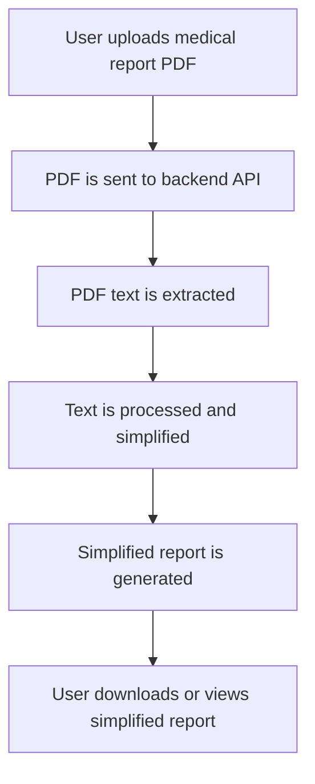
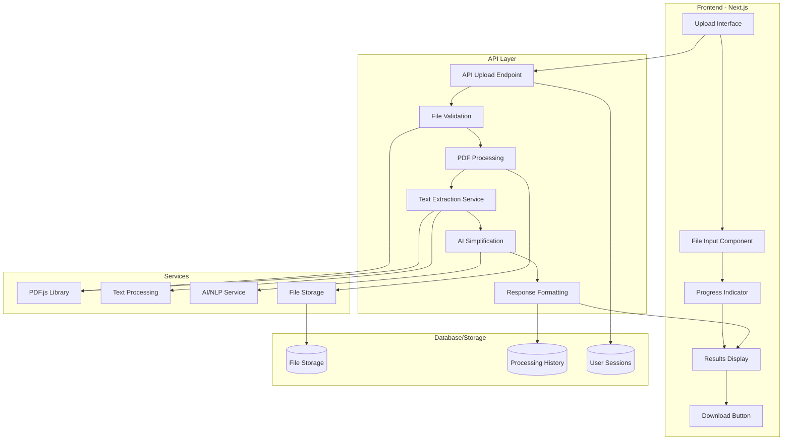
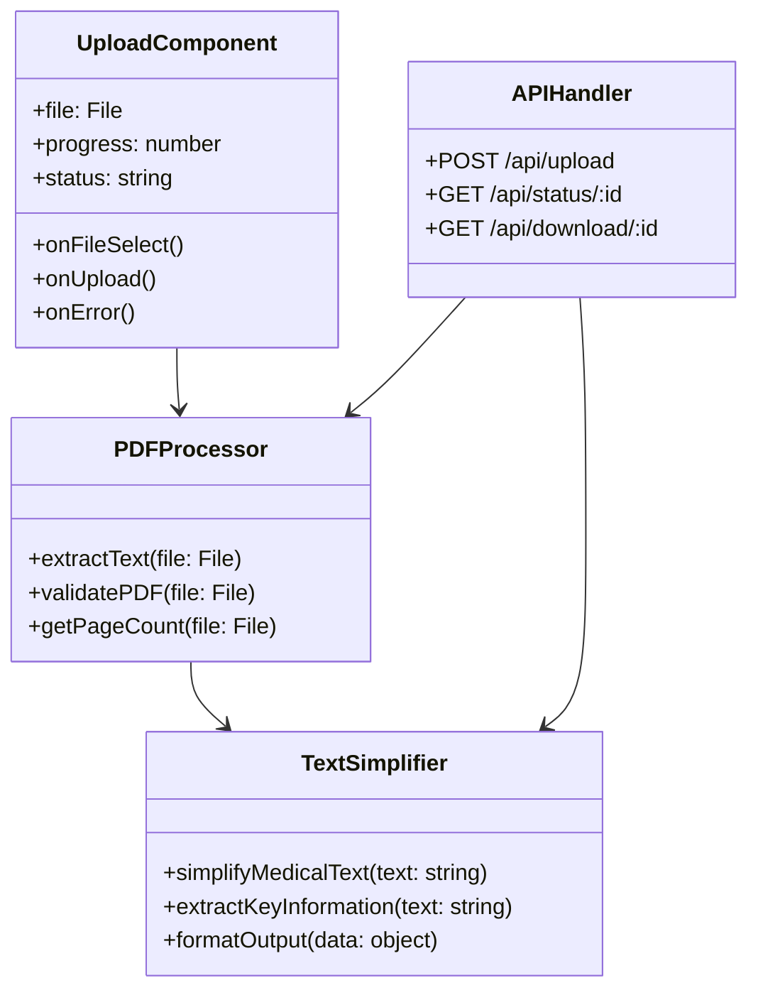
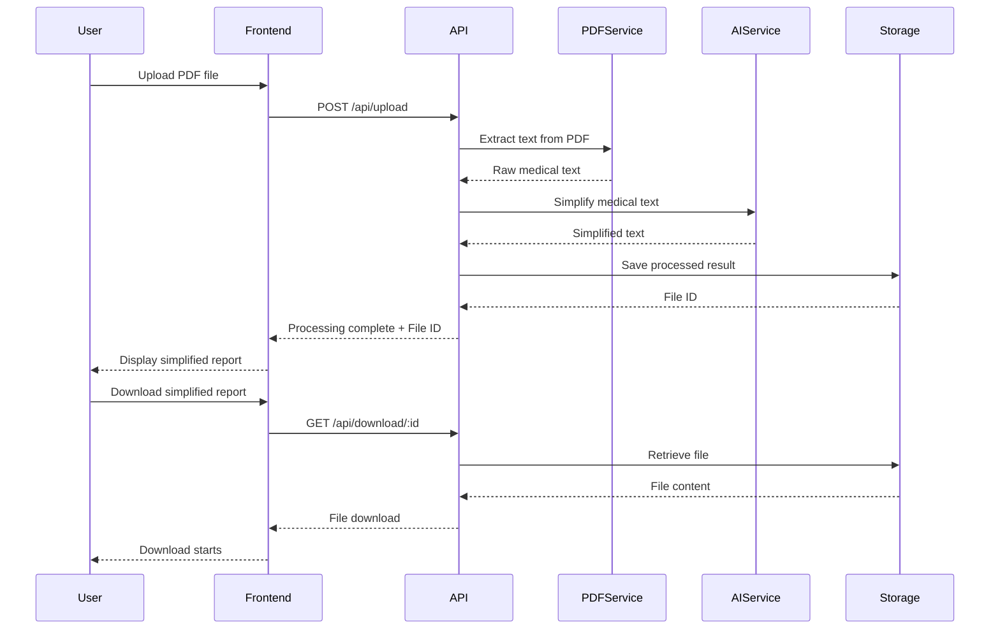

# Project Workflow Diagram

## High-Level Flow

```mermaid
flowchart TD
    A[User uploads medical report PDF] --> B[PDF is sent to backend API]
    B --> C[PDF text is extracted]
    C --> D[Text is processed and simplified]
    D --> E[Simplified report is generated]
    E --> F[User downloads or views simplified report]
```

## Detailed Technical Flow with Interfaces

```mermaid
flowchart TD
    subgraph "Frontend - Next.js"
        A[Upload Interface] --> B[File Input Component]
        B --> C[Progress Indicator]
        C --> D[Results Display]
        D --> E[Download Button]
    end

    subgraph "API Layer"
        F["API Upload Endpoint"] --> G[File Validation]
        G --> H[PDF Processing]
        H --> I[Text Extraction Service]
        I --> J[AI Simplification]
        J --> K[Response Formatting]
    end

    subgraph "Services"
        L[PDF.js Library]
        M[Text Processing]
        N[AI/NLP Service]
        O[File Storage]
    end

    subgraph "Database/Storage"
        P[(File Storage)]
        Q[(Processing History)]
        R[(User Sessions)]
    end

    A --> F
    G --> L
    I --> L
    I --> M
    J --> N
    H --> O
    O --> P
    K --> Q
    F --> R
    K --> D
```

## Component Interface Details

```mermaid
classDiagram
    class UploadComponent {
        +file: File
        +progress: number
        +status: string
        +onFileSelect()
        +onUpload()
        +onError()
    }

    class PDFProcessor {
        +extractText(file: File)
        +validatePDF(file: File)
        +getPageCount(file: File)
    }

    class TextSimplifier {
        +simplifyMedicalText(text: string)
        +extractKeyInformation(text: string)
        +formatOutput(data: object)
    }

    class APIHandler {
        +POST /api/upload
        +GET /api/status/:id
        +GET /api/download/:id
    }

    UploadComponent --> PDFProcessor
    PDFProcessor --> TextSimplifier
    APIHandler --> PDFProcessor
    APIHandler --> TextSimplifier
```

## Data Flow

```mermaid
sequenceDiagram
    participant User
    participant Frontend
    participant API
    participant PDFService
    participant AIService
    participant Storage

    User->>Frontend: Upload PDF file
    Frontend->>API: POST /api/upload
    API->>PDFService: Extract text from PDF
    PDFService-->>API: Raw medical text
    API->>AIService: Simplify medical text
    AIService-->>API: Simplified text
    API->>Storage: Save processed result
    Storage-->>API: File ID
    API-->>Frontend: Processing complete + File ID
    Frontend-->>User: Display simplified report
    User->>Frontend: Download simplified report
    Frontend->>API: GET /api/download/:id
    API->>Storage: Retrieve file
    Storage-->>API: File content
    API-->>Frontend: File download
    Frontend-->>User: Download starts
```
